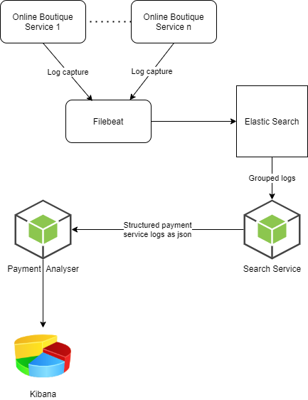

# Microsservices Logs Management

Aplicação para extrair informaçõs de logs de um ecossistema de microsserviços open-source denominado [online boutique](https://github.com/GoogleCloudPlatform/microservices-demo). O projeto visa o desenvolvimento de competencias técnicas relacionadas ao gerenciamento de logs em aplicações distribuídas, bem como estimular a criatividade na extração de informações a partir de dados não estruturados com o objetivo de obter insights de negócio.

## Arquitetura do projeto

O ecossistema de microserviços do online boutique foi hospedado em um serviço de gerenciamento de kubernets no google cloud (GKE).

Dentro do cluster criado, foram incluídos dois outros pods, o Elastic Search e o Filebeat. Este último é uma aplicação responsável por ler o terminal de outputs (stderr) das outras aplicações do cluster e enviar para o Elastic Search.

Foram criados ainda dois serviços node:

- O Search Service é responsável por buscar logs específicos de um determinado microsserviço do online boutique e estruturar suas informações em formato json.

- O Payment Analyser é o serviço que se comunica com o Search Service, obtém logs estruturados do serviço de pagamento e gera uma planilha de informações que será inputada no kibana, onde encontram-se métricas, tais como: quantidade e tipo de moedas transacionadas e quantidade de compras realizadas na aplicação.

## Tutorial de instalação

**Requisitos**
- [Docker]()
- [Minikube](https://minikube.sigs.k8s.io/docs/start/)
